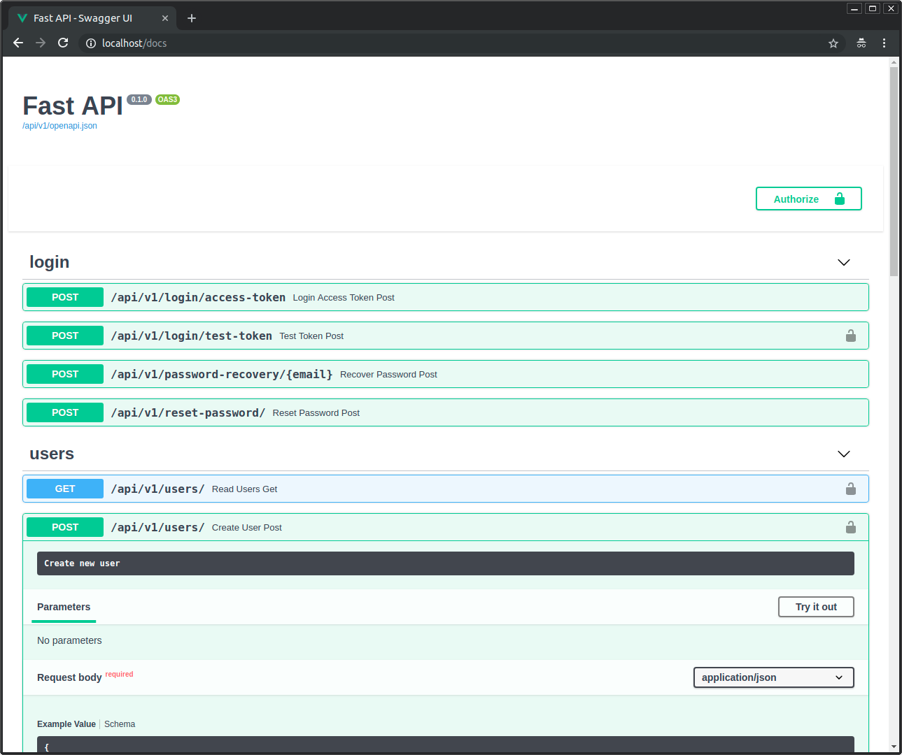

# Full Stack FastAPI with DocumentDB

<a href="https://github.com/fastapi/full-stack-fastapi-template/actions?query=workflow%3ATest" target="_blank"></a>
<a href="https://coverage-badge.samuelcolvin.workers.dev/redirect/fastapi/full-stack-fastapi-template" target="_blank"></a>

## Technology Stack and Features

- ⚡ [**FastAPI**](https://fastapi.tiangolo.com) for the Python backend API.
    - 🧰 [Beanie](https://beanie-odm.dev) for MongoDB/DocumentDB ODM (Object Document Mapper).
    - 🔍 [Pydantic](https://docs.pydantic.dev), used by FastAPI, for the data validation and settings management.
    - 💾 [DocumentDB](https://github.com/documentdb/documentdb) as the MongoDB-compatible document database.
- 🚀 [React](https://react.dev) for the frontend.
    - 💃 Using TypeScript, hooks, Vite, and other parts of a modern frontend stack.
    - 🎨 [Chakra UI](https://chakra-ui.com) for the frontend components.
    - 🤖 An automatically generated frontend client.
    - 🧪 [Playwright](https://playwright.dev) for End-to-End testing.
    - 🦇 Dark mode support.
- 🐋 [Docker Compose](https://www.docker.com) for development and production.
- 🔒 Secure password hashing by default.
- 🔑 JWT (JSON Web Token) authentication.
- 📫 Email based password recovery.
- ✅ Tests with [Pytest](https://pytest.org).
- 📞 [Traefik](https://traefik.io) as a reverse proxy / load balancer.
- 🚢 Deployment instructions using Docker Compose, including how to set up a frontend Traefik proxy to handle automatic HTTPS certificates.
- 🏭 CI (continuous integration) and CD (continuous deployment) based on GitHub Actions.

### Dashboard Login

[](https://github.com/fastapi/full-stack-fastapi-template)

### Dashboard - Admin

[](https://github.com/fastapi/full-stack-fastapi-template)

### Dashboard - Create User

[](https://github.com/fastapi/full-stack-fastapi-template)

### Dashboard - Items

[](https://github.com/fastapi/full-stack-fastapi-template)

### Dashboard - User Settings

[](https://github.com/fastapi/full-stack-fastapi-template)

### Dashboard - Dark Mode

[](https://github.com/fastapi/full-stack-fastapi-template)

### Interactive API Documentation

[](https://github.com/fastapi/full-stack-fastapi-template)

## What is DocumentDB?

[DocumentDB](https://github.com/documentdb/documentdb) is an open-source, MongoDB-compatible document database built on PostgreSQL. It combines the flexibility of MongoDB's document model with the reliability and ACID properties of PostgreSQL.

### Key Benefits:
- **MongoDB Compatibility**: Use existing MongoDB drivers and tools
- **ACID Transactions**: Full ACID compliance unlike traditional NoSQL databases
- **PostgreSQL Foundation**: Built on the robust PostgreSQL engine
- **Horizontal Scaling**: Designed for scalability and performance
- **Flexible Schema**: Document-based data model for rapid development

## Quick Start

### Prerequisites

- Docker and Docker Compose
- Python 3.10+
- Node.js 18+

### 1. Clone and Setup

```bash
git clone https://github.com/patty-chow/full-stack-fastapi-documentdb.git my-documentdb-app
cd my-documentdb-app
```

### 2. Configure Environment

Copy the example environment file and customize it:

```bash
cp env.example .env
```

Then edit the `.env` file with your configuration:

```env
# Project Configuration
PROJECT_NAME="FastAPI DocumentDB Project"
STACK_NAME="fastapi-documentdb-project"
SECRET_KEY="your-secret-key-here"
ENVIRONMENT="local"
DOMAIN="localhost"

# DocumentDB Configuration
DOCUMENTDB_HOST="localhost"
DOCUMENTDB_PORT=10260
DOCUMENTDB_USER="admin"
DOCUMENTDB_PASSWORD="your-documentdb-password"
DOCUMENTDB_DB="app"
DOCUMENTDB_AUTH_SOURCE="admin"

# User Configuration
FIRST_SUPERUSER="admin@example.com"
FIRST_SUPERUSER_PASSWORD="your-admin-password"

# Frontend Configuration
FRONTEND_HOST="http://localhost:5173"
BACKEND_CORS_ORIGINS="http://localhost:5173,http://localhost:3000"

# Docker Configuration
DOCKER_IMAGE_BACKEND="fastapi-documentdb-backend"
DOCKER_IMAGE_FRONTEND="fastapi-documentdb-frontend"
TAG="latest"
```

### 3. Generate Secret Keys

Generate secure keys for your application:

```bash
python -c "import secrets; print(secrets.token_urlsafe(32))"
```

Use the output for `SECRET_KEY`, `DOCUMENTDB_PASSWORD`, and `FIRST_SUPERUSER_PASSWORD`.

### 4. Start the Application

```bash
docker compose up -d
```

### 5. Access Your Application

- **Frontend**: http://localhost:5173
- **Backend API**: http://localhost:8000
- **API Documentation**: http://localhost:8000/docs
- **Database Admin**: http://localhost:8080

## 🎉 **Ready to Use!**

This template is now a **complete, production-ready FastAPI + DocumentDB application**. You can:

1. **Clone and run immediately** without any manual configuration
2. **Develop with modern async patterns** using FastAPI + DocumentDB
3. **Deploy to production** with the included Docker setup
4. **Scale horizontally** with DocumentDB's MongoDB-compatible architecture

### **Quick Start Summary**
```bash
# Replace with your actual repository URL
git clone https://github.com/patty-chow/full-stack-fastapi-documentdb.git my-documentdb-app
cd my-documentdb-app
cp env.example .env
docker compose up -d
```

**Access your application:**
- Frontend: http://localhost:5173
- Backend API: http://localhost:8000
- API Docs: http://localhost:8000/docs

**Develop with modern patterns:**
- Async/await throughout
- Document-based data model
- MongoDB-compatible operations
- No schema migrations needed

## Development Workflow

### Backend Development

The backend uses FastAPI with Beanie ODM for DocumentDB:

```bash
cd backend
uv sync
source .venv/bin/activate
fastapi dev app/main.py
```

### Frontend Development

The frontend uses React with TypeScript:

```bash
cd frontend
npm install
npm run dev
```

### Database Operations

DocumentDB uses MongoDB-compatible operations:

```python
# Create a user
user = User(email="user@example.com", full_name="John Doe")
await user.insert()

# Find users
users = await User.find_all().to_list()

# Update a user
user.full_name = "Jane Doe"
await user.save()
```

## Key Differences from SQL

### 1. Document Structure
Instead of tables and rows, DocumentDB uses collections and documents:

```python
# Beanie Document (current)
class User(Document):
    email: Indexed(EmailStr, unique=True)
    name: str

# Document Model (new)
class User(Document):
    email: Indexed(str, unique=True)
    name: str
    created_at: datetime = Field(default_factory=datetime.utcnow)
```

### 2. Async Operations
All database operations are now async:

```python
# Old (sync)
def get_user(session: Session, user_id: int):
    return session.get(User, user_id)

# New (async)
async def get_user(user_id: ObjectId):
    return await User.get(user_id)
```

### 3. No Migrations
DocumentDB doesn't require schema migrations like SQL databases:

```python
# Documents are created automatically when first inserted
user = User(email="test@example.com")
await user.insert()  # Collection created automatically
```

## Advanced Features

### Indexing
Create indexes for better performance:

```python
class User(Document):
    email: Indexed(str, unique=True)
    name: Indexed(str)
    
    class Settings:
        indexes = [
            [("email", 1), ("name", 1)],  # Compound index
        ]
```

### Aggregation
Use MongoDB aggregation pipelines:

```python
# Count users by status
pipeline = [
    {"$group": {"_id": "$is_active", "count": {"$sum": 1}}}
]
result = await User.aggregate(pipeline).to_list()
```

### Transactions
DocumentDB supports ACID transactions:

```python
async with client.start_session() as session:
    async with session.start_transaction():
        user = User(email="test@example.com")
        await user.insert(session=session)
        
        item = Item(title="Test Item", owner_id=user.id)
        await item.insert(session=session)
```

## Deployment

### Production Setup

1. **Set Environment Variables**:
   ```bash
   export ENVIRONMENT=production
   export DOMAIN=your-domain.com
   export DOCUMENTDB_PASSWORD=your-secure-password
   ```

2. **Deploy with Docker Compose**:
   ```bash
   docker compose -f docker-compose.yml up -d
   ```

3. **Configure Traefik** (optional):
   - Set up Traefik for automatic HTTPS
   - Configure domain routing
   - Enable load balancing

### Environment Variables

| Variable | Description | Default |
|----------|-------------|---------|
| `DOCUMENTDB_HOST` | DocumentDB server host | `localhost` |
| `DOCUMENTDB_PORT` | DocumentDB server port | `10260` |
| `DOCUMENTDB_USER` | Database username | `admin` |
| `DOCUMENTDB_PASSWORD` | Database password | Required |
| `DOCUMENTDB_DB` | Database name | `app` |
| `SECRET_KEY` | JWT secret key | Required |
| `FIRST_SUPERUSER` | Admin user email | Required |
| `FIRST_SUPERUSER_PASSWORD` | Admin user password | Required |

## Testing

### Backend Tests
```bash
cd backend
pytest
```

### Frontend Tests
```bash
cd frontend
npm test
```

### End-to-End Tests
```bash
npx playwright test
```

## Troubleshooting

### Common Issues

1. **Connection Refused**:
   - Ensure DocumentDB container is running
   - Check port 10260 is accessible
   - Verify TLS configuration

2. **Authentication Failed**:
   - Check `DOCUMENTDB_USER` and `DOCUMENTDB_PASSWORD`
   - Ensure `DOCUMENTDB_AUTH_SOURCE` is set correctly

3. **TLS Errors**:
   - DocumentDB requires TLS by default
   - Use `tlsAllowInvalidCertificates=true` for development

### Debug Mode

Enable debug logging:

```python
import logging
logging.basicConfig(level=logging.DEBUG)
```

## Contributing

1. Fork the repository
2. Create a feature branch
3. Make your changes
4. Add tests
5. Submit a pull request

## License

This project is licensed under the MIT License - see the [LICENSE](LICENSE) file for details.

